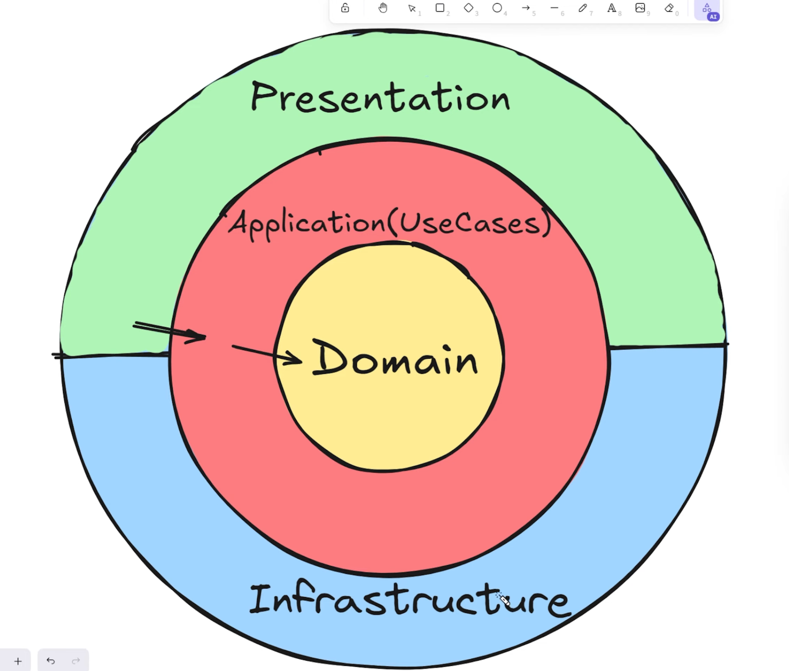

# Документация проекта

## Запущенные сервисы (Devcontainer)

| Сервис | Порт | Описание | URL (если есть) |
|--------|------|----------|------------------|
| Doxygen | `8000` | Документация кода | http://localhost:8000 |
| Structurizr | `8080` | Документация C4 | http://localhost:8080 |

#### Как использовать

1. После запуска devcontainer сервисы автоматически стартуют
2. Откройте браузер и перейдите по нужному URL

---

## Запущенные сервисы (docker-compose.yaml в корне проекта)

| Сервис | Порт | Описание | URL (если есть) |
|--------|------|----------|------------------|
| Structurizr | `5015` | ApiGateway | http://localhost:5015/swagger/index.html |
| Structurizr | `5050` | PgAdmin | http://localhost:5050 |
| Structurizr | `8080` | Документация C4 | http://localhost:8080 |

#### Как использовать

1. Зайти в корень проекта и выполнить команду docker-compose up
2. Дождаться запуска всех сервисов 
3. Перейти на http://localhost:5015/swagger/index.html - это небольшой ApiGateway
через который осуществляется доступ ко всем сервисам проекта
4. Перейти к Auth Service - V1 и выполнить запрос login (userName: admin password: admin)
5. после этого в cookie запишется jwt токен
6. Теперь можно перейти к Staff Service - v1 и выполнять запросы для получения списка пользователей

Доступ в pg_admin: email: admin@admin.com password: admin

## Основное описание проекта

Проект реализован с применением микросервисной архитектуры, а каждый микросервис построен по принципам Clean Architecture.

При реализации проекта использовались следующие архитектурные паттерны и подходы:

 - DTO (Data Transfer Object)
 - Repository
 - Dependency Injection

## Что можно было бы улучшить 

1. Улучшение JWT-аутентификации и авторизации — добавление двух типов токенов: access и refresh для повышения безопасности сервиса

2. Добавление документации к коду — C4-описание архитектуры и комментарии в коде

3. Перенос всех необходимых параметров (время жизни JWT-токена, секретный ключ и т.д.) в .env и удаление .env из открытого доступа

4. Улучшить базу данных в Staff сервисе — добавить новые таблицы, например job_positions, и использовать их в основной таблице для нормализации данных, упрощения управления должностями и удобства фильтрации